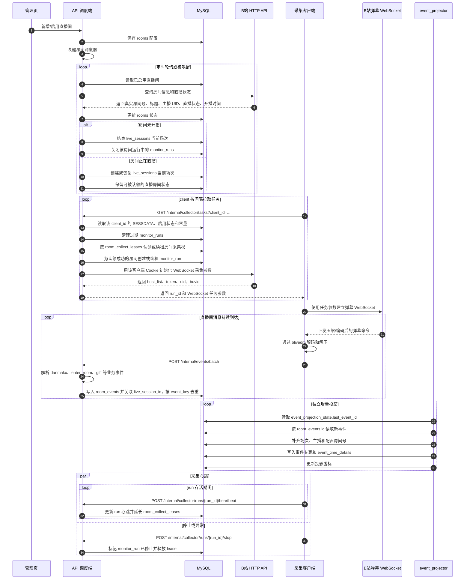

# blivedm 拆分式直播间监控

这个仓库拆成两个可以独立运行的 Python 项目：

- `api/`：FastAPI 调度端。负责 MySQL、直播间管理、B 站 HTTP 接口、直播状态轮询、WebSocket 采集任务生成、事件解析和事件入库。
- `client/`：采集客户端。负责从 API 拉取任务，使用 API 下发的参数连接 B 站弹幕 WebSocket，通过 `blivedm` 解码/解压消息，并把原始命令回传给 API。

采集客户端不调用 B 站 HTTP 接口，也不连接 MySQL。

## 项目备注

- API 进程是控制面：保存直播间配置，轮询 B 站 HTTP 接口，判断哪些房间正在直播，并创建短生命周期的采集任务。
- client 进程是数据面：维护长时间运行的 B 站 WebSocket 连接，并把解码后的原始命令转发回 API。
- 这样拆分后，数据库账号和 B 站 HTTP 交互都留在 API 侧。采集端部署到其他机器时只需要 `API_BASE_URL` 和稳定的 `COLLECTOR_CLIENT_ID`。
- B 站同时存在“配置房间号”和“真实房间号”。管理页输入的是配置房间号，API 会保存 B 站返回的真实房间号，并用真实房间号做 WebSocket 采集。
- 直播场次记录在 `live_sessions` 表。API 轮询到 `live_status == 1` 时，用 B 站房间信息里的 `live_time` 作为 `started_at` 创建或恢复当前场次；轮询到下播时写入 `ended_at`。`monitor_runs` 只表示采集连接运行，不等同于直播场次。
- 当前采集归属记录在 `room_collect_leases` 表。每个真实房间号只有一条 lease，client 心跳会续租；client 挂掉超过 `COLLECTOR_STALE_SECONDS` 后，其他 client 才能接管，避免同一房间被多个客户端同时采集。
- 采集端把原始命令提交到 `/internal/events/batch`。事件解析集中在 API 侧，后续调整解析规则时不需要重新部署每个采集端。
- 当前只入库已知业务事件：`danmaku`、`enter_room`、`gift`、`guard`、`super_chat`。删除醒目留言、互动提示、点赞提示、购物车、排名变化、连麦状态、礼物连击、未知命令和解析失败都会被主动忽略。
- 已知事件的分析专表由独立 `event_projector` 进程增量生成。`room_events` 是原始事实表，`danmaku_events`、`enter_room_events`、`gift_events`、`guard_events`、`super_chat_events` 和 `event_time_details` 用于用户、主播、场次和时间维度统计。
- B 站 `SESSDATA` 通过管理页按 `client_id` 单独配置，保存在 `collector_clients` 表。普通直播间可能匿名也能访问，但如果 B 站对 WebSocket 配置加强校验，给对应采集客户端配置 Cookie 会更稳。

## 运行方式

```sh
cd api
cp .env.example .env
# 编辑 .env，至少设置 MYSQL_PASSWORD
uv sync --extra test
uv run python -m blivedm_api.main
```

可选但建议单独启动事件投影进程，用于把 `room_events` 增量投影到分析专表：

```sh
cd api
uv run python -m blivedm_api.event_projector
```

```sh
cd client
cp .env.example .env
uv sync
uv run python -m blivedm_client.main
```

管理页：`http://127.0.0.1:8000/`

管理页里的“采集客户端 Cookie”区域用于维护每个 `COLLECTOR_CLIENT_ID` 对应的 `SESSDATA`、启用状态和最大采集房间数，可以粘贴纯值或包含 `SESSDATA=...` 的 Cookie 片段。列表只显示脱敏预览，不会把完整 Cookie 回显到页面。

## 数据流

1. API 通过 B 站 HTTP 接口轮询已启用直播间。
2. API 只为正在直播的房间创建采集任务。
3. client 从 `/internal/collector/tasks` 拉取任务。
4. client 连接 B 站弹幕 WebSocket，并解码消息。
5. client 把原始命令提交到 `/internal/events/batch`。
6. API 解析事件并写入 MySQL，事件会关联当前 `live_session_id`。
7. event projector 按 `room_events.id` 增量生成事件专表和 `event_time_details` 时间维度明细。

## 时序图

下面的时序图描述项目的主链路：管理页配置直播间，API 调度端轮询 B 站并生成采集任务，client 认领任务后连接 B 站 WebSocket，最后把原始命令批量回传给 API 入库。


